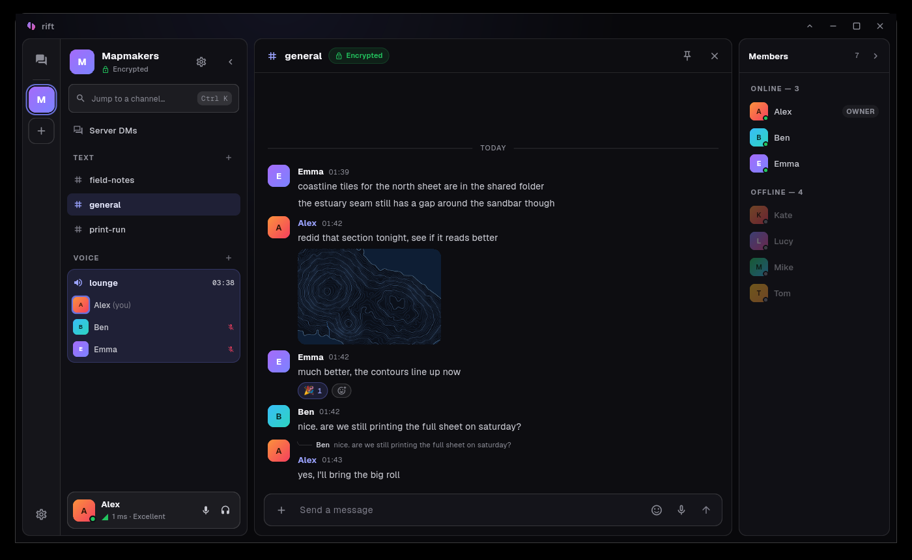
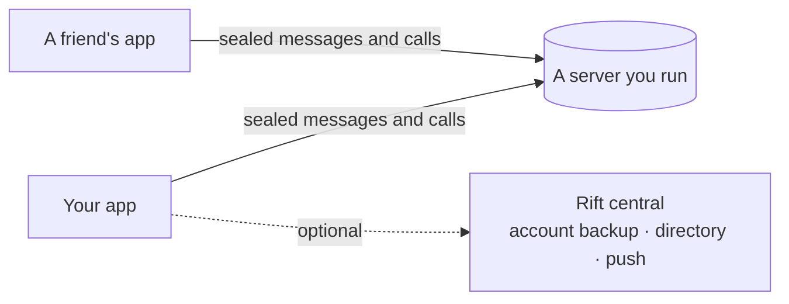
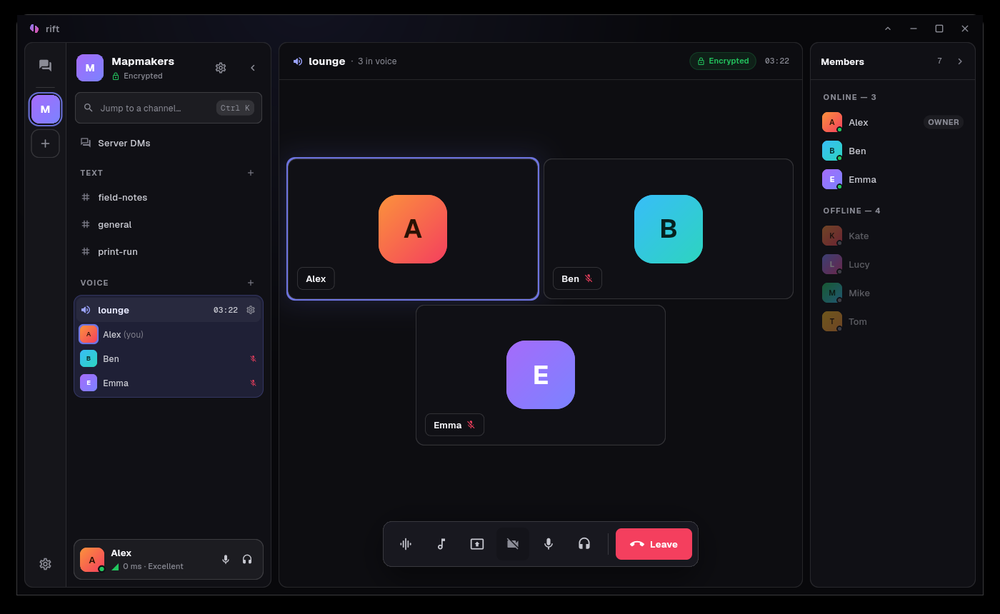

<p align="center">
  
</p>

<h1 align="center">Rift</h1>

<p align="center">
  <b>Your own place to talk. Nobody else's.</b><br>
  Chat, voice, video and screen sharing, end-to-end encrypted, on servers you run.
</p>

<p align="center">
  <a href="https://github.com/awais-amjed/rift/releases/latest">Download</a> ·
  <a href="https://joinrift.app">Website</a> ·
  <a href="https://docs.joinrift.app">Run a server</a> ·
  <a href="ARCHITECTURE.md">How it works</a> ·
  <a href="https://github.com/awais-amjed/rift-bot-sdk">Build a bot</a>
</p>

<p align="center">
  
  
</p>

<p align="center">
  
</p>

## About

Rift is an open-source, self-hostable alternative to Discord that keeps your
data in your hands. Messages, files and calls are encrypted on your device
before they leave, so even the server can't read them. Run a server for your
friends, your club or your team, and use the optional directory to find other
communities and the people in them.

## Rift and Discord

<table width="100%">
  <thead>
    <tr>
      <th align="left" width="60%">Feature</th>
      <th align="center" width="20%">Discord</th>
      <th align="center" width="20%">Rift</th>
    </tr>
  </thead>
  <tbody>
    <tr>
      <td>Text and voice channels</td>
      <td align="center">✅</td>
      <td align="center">✅</td>
    </tr>
    <tr>
      <td>Direct messages and DM calls</td>
      <td align="center">✅</td>
      <td align="center">✅</td>
    </tr>
    <tr>
      <td>Video calls</td>
      <td align="center">✅</td>
      <td align="center">✅</td>
    </tr>
    <tr>
      <td>Screen sharing</td>
      <td align="center">✅</td>
      <td align="center">✅</td>
    </tr>
    <tr>
      <td>Screen sharing with system audio</td>
      <td align="center">✅</td>
      <td align="center">✅</td>
    </tr>
    <tr>
      <td>1080p 60fps screen sharing</td>
      <td align="center">✅ (with Nitro)</td>
      <td align="center">✅</td>
    </tr>
    <tr>
      <td>Large file uploads</td>
      <td align="center">✅ (with Nitro)</td>
      <td align="center">✅</td>
    </tr>
    <tr>
      <td>Soundboard</td>
      <td align="center">✅</td>
      <td align="center">✅</td>
    </tr>
    <tr>
      <td>Voice messages</td>
      <td align="center">✅</td>
      <td align="center">✅</td>
    </tr>
    <tr>
      <td>Replies, reactions, pins and polls</td>
      <td align="center">✅</td>
      <td align="center">✅</td>
    </tr>
    <tr>
      <td>Bots and webhooks</td>
      <td align="center">✅</td>
      <td align="center">✅</td>
    </tr>
    <tr>
      <td>A directory to find communities</td>
      <td align="center">✅</td>
      <td align="center">✅</td>
    </tr>
    <tr>
      <td>End-to-end encrypted calls</td>
      <td align="center">✅</td>
      <td align="center">✅</td>
    </tr>
    <tr>
      <td>End-to-end encrypted messages</td>
      <td align="center">❌</td>
      <td align="center">✅</td>
    </tr>
    <tr>
      <td>Run your own server</td>
      <td align="center">❌</td>
      <td align="center">✅</td>
    </tr>
    <tr>
      <td>Use it without an account</td>
      <td align="center">❌</td>
      <td align="center">✅</td>
    </tr>
    <tr>
      <td>Open source</td>
      <td align="center">❌</td>
      <td align="center">✅</td>
    </tr>
    <tr>
      <td>Message search</td>
      <td align="center">✅</td>
      <td align="center">❌</td>
    </tr>
    <tr>
      <td>Threads and forum channels</td>
      <td align="center">✅</td>
      <td align="center">❌</td>
    </tr>
    <tr>
      <td>Custom emoji and stickers</td>
      <td align="center">✅</td>
      <td align="center">❌</td>
    </tr>
  </tbody>
</table>

## How it fits together



- **The app**, this repository, holds your identity: one seed on your device,
  backed up only if you choose, and encrypted before it leaves.
- **A server** is yours. It stores ciphertext it cannot open and enforces who
  may do what. See [`rift-self-host`](https://docs.joinrift.app/install/).
- **Central** is the one shared piece, and it's optional. It provides
  accounts, the directories of public servers and bots, and the relay that
  wakes phones. It never sees a server's messages.

<p align="center">
  
</p>

## Features

- 🔒 **End-to-end encrypted.** Messages, attachments, voice notes and calls are
  sealed and signed on your device, and every attachment has a key of its own
- 🗄️ **Servers you run.** Text and voice channels, private channels, roles and
  invites, plus your own limits on history, storage and call size
- 🎙️ **Voice and screen sharing** with native capture, and system audio on Linux
  and Windows
- 💬 **Direct messages** on a server, and between friends across servers
- 📞 **Calls in DMs**, encrypted with a key the server never holds
- ↩️ **The everyday tools:** replies, forwards, reactions, pins, polls, mentions,
  and link previews made by the sender, so the server never fetches your links
- 🛡️ **Moderation:** reports, time-outs and bans, plus control over who can DM you
- 🙈 **Sensitive images blurred on your device**, by a classifier that runs
  locally, since a server can't scan what it can't read
- 🤖 **Bots and webhooks** through a public TypeScript SDK. What a bot writes is
  marked, because the server can read it

## Get started

### 1. Install Rift

| Platform | Download |
|---|---|
| **Windows** (64-bit) | [`Rift-<version>-windows-x64-setup.exe`](https://github.com/awais-amjed/rift/releases/latest) |
| **Linux** (x86-64) | [`rift-<version>-linux-x64.tar.gz`](https://github.com/awais-amjed/rift/releases/latest) |
| **Android** and the **browser** | Coming soon |

**On Windows**, run the installer. It isn't signed yet, so Windows may say
"Windows protected your PC": choose **More info**, then **Run anyway**.

**On Linux**, unpack it and run `rift`:

```bash
tar -xzf rift-*-linux-x64.tar.gz
./rift-*-linux-x64/rift
```

It needs Ubuntu 24.04, Debian 13, Fedora 40, Mint 22 or newer, or any rolling
distribution.

### 2. Make your identity

Open Rift and choose how you want to exist:

- **Continue with an account** if you want your identity backed up, encrypted,
  and want friends to find you by name.
- **Use privacy mode** if you'd rather skip the email. Your identity never
  leaves your device.

### 3. Join a server

- **Got an invite link?** Press **+** in the server list, then **Join server**,
  and paste it.
- **Looking for a community?** Press **+**, then **Browse servers**, to see the
  public ones.

### 4. Or run your own

A server is a few commands on a machine with Docker, about 4 GB of RAM and a
domain pointing at it: a spare PC or a small VPS. The
[self-hosting guide](https://docs.joinrift.app/install/)
walks through it, and its console gives you the first invite link. It also has
a local-testing mode for trying Rift on one machine.

## Building it

You need [Flutter](https://docs.flutter.dev/get-started/install) (stable,
3.41 or newer) and a [Rust](https://rustup.rs) toolchain.

```bash
flutter pub get
flutter run -d linux        # or windows, android, chrome
```

The Rust crate builds itself through `flutter_rust_bridge` and Cargokit on the
first run; `build_rust_local.sh` builds it by hand.

On Linux you also need clang 21 or newer, because the WebRTC library refuses an
older one, and these development packages:

```bash
# Debian and Ubuntu. 24.04 ships clang 18: take clang-21 from apt.llvm.org,
# and build with CC=clang-21 CXX=clang++-21.
sudo apt install cmake ninja-build pkg-config libgtk-3-dev libsecret-1-dev \
  libgstreamer1.0-dev libgstreamer-plugins-base1.0-dev libpulse-dev libva-dev \
  libayatana-appindicator3-dev

# Arch
sudo pacman -S clang cmake ninja gtk3 libsecret gstreamer gst-plugins-base \
  libpulse libva libayatana-appindicator
```

`scripts/package_linux.sh` builds the release archive the way the release
workflow does.

## Tests

```bash
flutter analyze
flutter test                 # pure logic, crypto and layout invariants
./scripts/style_check.sh     # size budgets, lazy lists, literals, layering
```

The databases have their own suites in the server repositories. Anything that
needs a live server — realtime delivery, key distribution, calls, layout at a
width — is driven by hand; [`TESTING.md`](TESTING.md) records what has been
checked and how to drive each client.

## Documentation

| Document | For |
|---|---|
| [`ARCHITECTURE.md`](ARCHITECTURE.md) | the shape of the system, and the decisions behind it |
| [`WIRE.md`](WIRE.md) | the exact formats a second implementation must match |
| [`BOTS.md`](BOTS.md) | what a bot may see, hear and say |
| [`TESTING.md`](TESTING.md) | what has been verified live, what has not, and how to drive the app |
| [`AGENTS.md`](AGENTS.md) | the conventions this codebase follows |
| [`CODE_STYLE.md`](CODE_STYLE.md) | size budgets, one widget per file, where constants live |

What a client may call on a server, and over which transport, is `API.md` in
`rift-self-host`. Running a server is covered by the
[self-hosting guide](https://docs.joinrift.app/).

## Related repositories

Clone them side by side: `tool/gen_wire_vectors.dart` writes the bot SDK's copy
of the wire contract, and the docs refer to the others by name.

| Repository | What it is | Who runs it |
|---|---|---|
| **`rift`** | this: the app | — |
| [`rift-self-host`](https://github.com/awais-amjed/rift-self-host) | a server's schema, endpoints and console | anyone |
| [`rift-central`](https://github.com/awais-amjed/rift-central) | accounts, the server and bot directories, the push relay | the project |
| [`rift-bot-sdk`](https://github.com/awais-amjed/rift-bot-sdk) | the TypeScript bot SDK | bot authors |

## License

[GPL-3.0](LICENSE). Third-party notices ship with the app in
[`assets/licenses/`](assets/licenses/).
